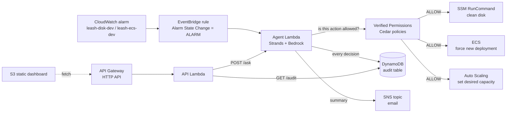

# Leash

**An ops agent that can fix your AWS at 3 AM, but can never destroy anything — because Cedar says so.**

Built by **thegoodengineers** (Bhumika Gurav, Chirag Honnyal, Abhijeet Sharma, Ayush V Upadhye)
during **First Commit — Bharat Builds Tour Stop 01** (WeMakeDevs x AWS), 17–20 September 2026.
Track: **Ship It**.

## The problem

Small teams run on AWS with nobody watching at 3 AM. A disk fills, a container crashes, an alarm
fires, and the fix is a boring known step — but the human is asleep. Letting an AI agent run the
fix is scary for a good reason: an agent with admin keys can also delete the database, and a clever
prompt can talk it into doing so. So nobody automates the fix.

## What Leash does

A Strands agent receives CloudWatch alarms, diagnoses, and runs the fix — where **every action is
first checked against Cedar policies in Amazon Verified Permissions**. It can restart, scale and
clean up; it can never delete, never touch anything tagged `env=prod`, and never scale past a cap,
no matter how it is prompted. Every decision, allowed or denied, is written to an audit trail.

## Architecture



| Service | Role in Leash | Why this service |
| --- | --- | --- |
| **Amazon Verified Permissions** | Holds the four Cedar policies; every mutating tool asks `IsAuthorized` before touching anything. | The leash itself. Policy lives outside the model and outside the prompt, so no prompt injection can loosen it. Decisions come back with the policy ids that fired, which is what the audit trail shows. |
| **Amazon Bedrock** | Runs the model behind the Strands agent (default `us.anthropic.claude-haiku-4-5-20251001-v1:0`, fallback `us.amazon.nova-lite-v1:0`). | Managed inference in-region with IAM auth; no API keys to leak into a Lambda. |
| **Strands Agents SDK** | The agent loop: tools are plain Python functions with `@tool`. | Small, Bedrock-native, and the tool surface is exactly where we put the authorisation check. |
| **AWS Lambda** | Agent function (300 s, 1 GB) and API function (30 s, 256 MB). | Event-driven; the agent only exists while an incident is being handled. Costs nothing at rest. |
| **Amazon EventBridge** | Routes `CloudWatch Alarm State Change` events with `alarmName` prefix `leash-` into the agent. | Decouples alarms from the agent; the same rule can fan out to more targets later. |
| **Amazon CloudWatch** | CWAgent `disk_used_percent` and Container Insights `RunningTaskCount` alarms. | The signal that starts everything. Alarm dimensions carry the resource ids the agent acts on. |
| **AWS Systems Manager** | `AWS-RunShellScript` on the dev instance to free disk space. | No SSH, no inbound ports, and IAM can scope `SendCommand` to instances tagged `env=dev`. |
| **Amazon ECS on Fargate** | The breakable nginx service `leash-api-dev`. | Killing a task is a realistic, repeatable incident; the fix (`forceNewDeployment`) is safe. |
| **EC2 Auto Scaling** | `leash-dev-asg` with max 6, desired 0. | Lets the scale cap (4) be demonstrated without running any instances. |
| **Amazon DynamoDB** | Audit table, one item per ALLOW/DENY decision, GSI for "newest first". | On-demand, serverless, and the dashboard needs exactly one query. |
| **Amazon SNS** | Email summary at the end of each incident. | The human wakes up to a summary, not a pager. |
| **API Gateway (HTTP API) + S3** | `/health`, `/audit`, `/ask` and a static dashboard. | The cheapest way to show the audit trail and to let a human ask the agent to do something it must refuse. |
| **AWS SAM / CloudFormation** | One stack, one `sam deploy`, one `sam delete`. | Reproducible for judges and for teardown. |

## How the leash works

The agent never calls an AWS mutating API directly. Every mutating tool does three things in
order: `authorize()` against Verified Permissions, act only if allowed, then `write_audit()` with
the decision and the policy ids. The principal is always `Leash::Agent::"leash"`; the resource's
`env` comes from its tags (missing tag = `"unknown"`, which is denied).

The four policies, as specified (**see `cedar/policies/` for the source of truth**):

```cedar
// PermitDevRemediation.cedar
permit (
    principal == Leash::Agent::"leash",
    action in [Leash::Action::"cleanDisk", Leash::Action::"restartService", Leash::Action::"scaleGroup"],
    resource
) when { resource.env == "dev" };
```

```cedar
// ForbidDestructive.cedar
forbid (
    principal,
    action in [Leash::Action::"terminateInstance", Leash::Action::"deleteResource"],
    resource
);
```

```cedar
// ForbidProd.cedar
forbid (principal, action, resource) when { resource.env == "prod" };
```

```cedar
// ForbidScaleAboveCap.cedar
forbid (
    principal,
    action == Leash::Action::"scaleGroup",
    resource
) when { context.desiredCapacity > 4 };
```

Cedar is deny-by-default and `forbid` always wins over `permit`, so the model cannot argue its way
past a policy: the worst it can do is ask, be denied, and have the denial recorded. Underneath, the
agent's IAM role also has an explicit `Deny` on every delete/terminate API and can only send SSM
commands to `env=dev` instances. Cedar is the leash; IAM is the floor. See
[docs/ARCHITECTURE.md](docs/ARCHITECTURE.md).

## Deploy

Prerequisites:

- An AWS account with **Bedrock model access** enabled for the model in `BedrockModelId`
  (Bedrock console -> Model access) in `us-east-1`.
- AWS CLI v2 and SAM CLI installed and `aws sts get-caller-identity` working.
- Python 3.11 on any OS. Dependencies are shipped as a **Lambda layer built for Linux x86_64 by
  `scripts/build-deps.sh`** (uv's cross-platform resolver), so `sam build` never runs pip against
  your own OS and no Docker is needed. `strands-agents -> mcp` declares `pywin32` for Windows,
  which breaks the default SAM python builder on a Windows host; the layer sidesteps that.

```bash
git clone <this repo> && cd leash
scripts/deploy.sh          # build-deps.sh, sam build, sam deploy --guided on first run; then writes
                           # dashboard/config.js and syncs dashboard/ to the S3 website bucket
scripts/stop-prod.sh       # stop the env=prod instance (it only exists to be denied)
aws cloudformation describe-stacks --stack-name leash --query 'Stacks[0].Outputs'
```

Parameters asked on first deploy: `AlertEmail` (confirm the SNS subscription email), `VpcId`,
`SubnetId` (your default VPC is fine), optional `KeyName`, and `BedrockModelId`.
Tear down with `scripts/teardown.sh` (empties the bucket, then `sam delete`).

Run the tests locally (no AWS account needed; the Cedar policies are evaluated for real with
[cedarpy](https://pypi.org/project/cedarpy/), and every boto3 client is faked):

```bash
pip install -r requirements-dev.txt
PYTHONPATH=src python -m pytest -q
sam validate --lint && sam validate --lint --template cedar/template.yaml
```

## Demo script

Four beats, each visible on the dashboard (`DashboardUrl` output):

1. **Fill the disk -> auto-fix.** `scripts/break-disk.sh` fallocates a file on the dev instance
   until usage is above 90 %. `leash-disk-dev` alarms, EventBridge invokes the agent, the agent
   reads the disk, calls `clean_disk` (ALLOW by `PermitDevRemediation`), SSM removes the file, and
   an email summary arrives.
2. **Kill the task -> auto-redeploy.** `scripts/kill-task.sh` stops the nginx task. `leash-ecs-dev`
   alarms, the agent calls `restart_service` (ALLOW) and ECS rolls a new task.
3. **Ask it to terminate -> denied with policy id.** `scripts/ask.sh "Terminate the dev web
   instance"` (or the dashboard box). The agent tries `terminate_instance`, gets
   `DENIED by ForbidDestructive`, and says so. Try "restart the prod db" (`ForbidProd`) and
   "scale leash-dev-asg to 10" (`ForbidScaleAboveCap`) too.
4. **Dashboard.** Green ALLOW rows and red DENY rows with the policy ids, newest first.

The timed shot list for the video is in [docs/DEMO-SCRIPT.md](docs/DEMO-SCRIPT.md).

## Cost decisions

- Two `t3.micro` instances (one of which is stopped after deploy) and one 0.25 vCPU Fargate task
  are the only always-on cost; the ASG sits at desired 0.
- Lambda, DynamoDB (on-demand), Verified Permissions, EventBridge, SNS and S3 are pay-per-use and
  effectively free at demo volume.
- Bedrock: Haiku-class model, short system prompt, a handful of tool calls per incident.
- `scripts/teardown.sh` removes everything; nothing is left behind except CloudWatch logs.

## AI tools used

Claude Code (Claude Fable 5.1) was used to scaffold and review the code. All architecture
decisions, the policy design and the demo were made by the team; every generated file was read and
tested locally before being kept.

## Team

**thegoodengineers** — Bhumika Gurav, Chirag Honnyal, Abhijeet Sharma, Ayush V Upadhye.

## Licence

MIT — see [LICENSE](LICENSE).
